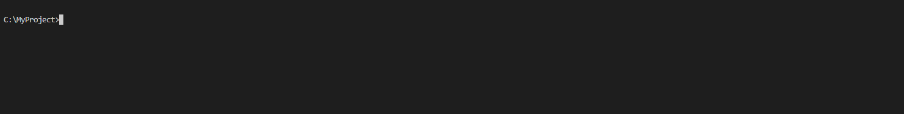
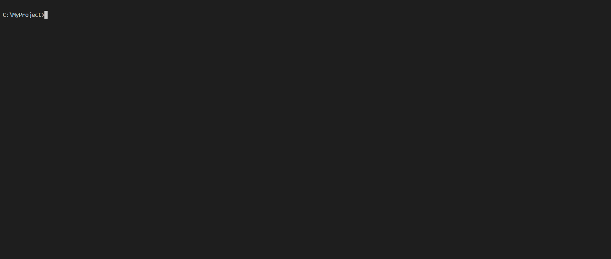
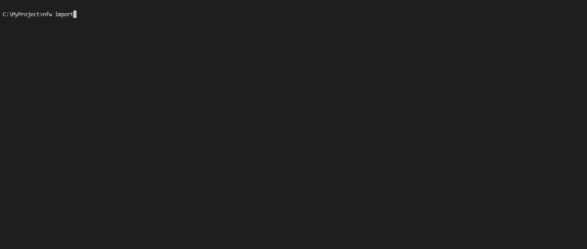
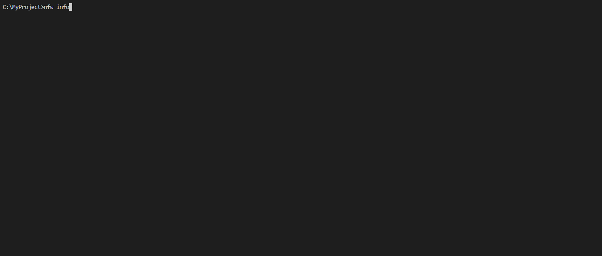
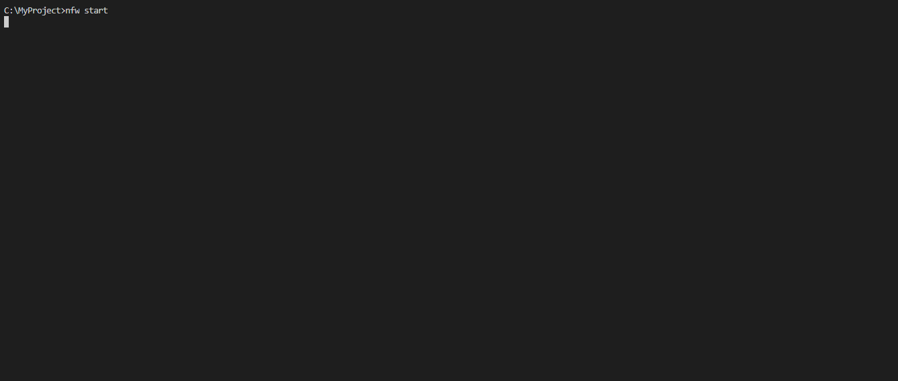

# Node FrameWork

This repository contains a CLI based app that generate a NodeJs API base on [3rd_party_ts_boilerplate](https://github.com/AmauryD/3rd-party-ts-boilerplate)

Commands :

* [nfw new](#New)
* [nfw test](#Test)
* [nfw generate](#generate)
* [nfw import](#import)
* [nfw delete](#delete)
* [nfw info](#info)
* [nfw start](#start)
* [nfw migrate](#migrate)

# New

Command :

 ```bash
 $ nfw new <appName> [Options]
 ```
##### Alias

    $ nfw n

##### Parameters

* **_Application name_** - Required ! Type: string
* **_Option_** - Optionnal ! See details below

#### Description

Generate a new project.


### Option

* --env

Usage

```bash
$ nfw new --env
```
#### Description

Generate a new project asking for environement variables such as :

* Environement      ("Development"/"Production"/"Staging"/"Test")
* Port              (Ex : 8000)
* Database Host     (Ex : localhost or your-domain.org)
* Database Username (Ex : root or User1)
* Database Passord  (Hidden by default)
* Database port     (ex : 3306)
* Path validation 
    * New path 
* Project Name      (Ex: my_new_project)


# Test 

**You have to be in the project directory to execute this command !**

Command :

 ```bash
 $ nfw test
 ```

##### Alias

    $ nfw t

#### Description

Compile TypeScript and execute unit tests



### Option

* --logs

Usage

```bash
$ nfw test --logs
```
#### Description

Compile TypeScript and execute unit test with full output.



# Generate

**You have to be in the project directory to execute this command !**

Command :

 ```bash
 $ nfw generate <modelName> [CRUD]
 ```
##### Aliases

    $ nfw g <modelName> [CRUD]
    $ nfw gen <modelName> [CRUD]

##### Parameters

* **_modelName_** - Required ! Type: string
* **_CRUD_** - Optionnal ! Type: string with C, R, U, D letter only
    * Specify the generate function which part of the CRUD it must generate.
#### Description

Generate a model, a controller, a serializer, ... Ready to use with the API.
Then generate a MySQL migration and execute it.


# Import

**You have to be in the project directory to execute this command !**

Command :

 ```bash
 $ nfw import
 ```
##### Aliases

    $ nfw imp

#### Description

Generate model base on the tables existing in the database. **WARNING**: It will ovveride existing models with the same name !



# Delete

**You have to be in the project directory to execute this command !**

Command :

 ```bash
 $ nfw delete <modelName>
 ```
##### Aliases

    $ nfw D <modelName>
    $ nfw del <modelName>

##### Parameters

* **_modelName_** - Required ! Type: string

#### Description

Delete a generated model with all the related files. Drop the related table and execute a SQLDump.


# Info

Command :

 ```bash
 $ nfw info
 ```
#### Description

Show informaion about who developed the software.



# Start

**You have to be in the project directory to execute this command !**

Command :

 ```bash
 $ nfw start
 ```

#### Description

Start the API.



### Options

* --env

Usage

```bash
$ nfw start --env=<Environement>
```
##### Parameter

* **_Environement_** - Required ! Type: string *["Development","Production","Staging","Test"]*
    
#### Description

Compile TypeScript and execute unit test with full output.


# Migrate

**You have to be in the project directory to execute this command !**

Command :

 ```bash
 $ nfw migrate
 ```

#### Description

Compile TypeScript, generate a TypeORM migration, recomplie, then execute the migration script.


# Commands options

## Option:

* --version

### Description

Show the current version

## Option

* --help or -h

### Description

Show help for every commands or a specified command

Exemple *(general)*


Exemple *(for a specific command)*


