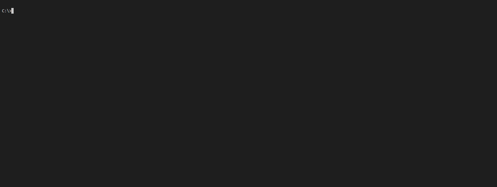

# Node FrameWork

This repository contains a CLI based app that generate a NodeJs API base on [3rd_party_ts_boilerplate](https://github.com/AmauryD/3rd-party-ts-boilerplate)

Commands :

* nfw new
* nfw test
* nfw generate
* nfw import
* nfw delete
* nfw info
* nfw start
* nfw migrate

## Command : nfw new

Command :

 ```bash
 $ nfw new 
 ```
#### Description

Generate a new project. Ask if the path is right, if not it asks for a new one, then ask for a name.

;
### Option

* --env

Usage

```bash
$ nfw new --env
```
#### Description

;