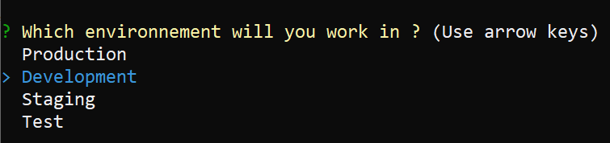
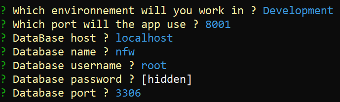
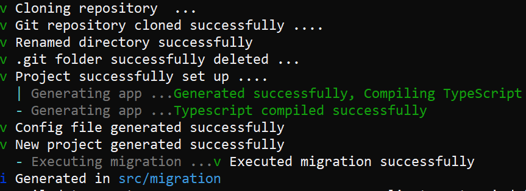

# New command

- Aliases : **n**

## Arguments

### name
- description : Name of the project
- type : string

## Options

### default
- description : Generate a project with default env variables
- type : boolean
- default : false

### path
- description : Allow the user to choose a different path
- type : boolean
- default : false

### docker
- description : Set a mysql container up
- type : boolean
- default : false

### yarn
- description : Set yarn as package manager instead of npm
- type : boolean
- default : false

## Basic Usage

To setup a new project run 

```sh
    nfw new <name>
```

### Environment choice

The console will prompt you 4 available environments to choose from , by default the Development environment is selected



### Setting up env variables

Then it will ask you your database environment settings



### Cloning and installing packages
 
- The installation will finish by installing the required packages , generate a migration in order to create your database and create an admin for your API
- The admin informations will be created in the **credentials.json** file



## Known problems

--